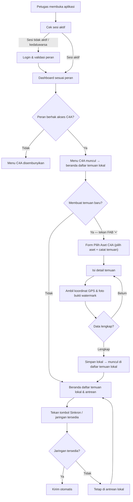
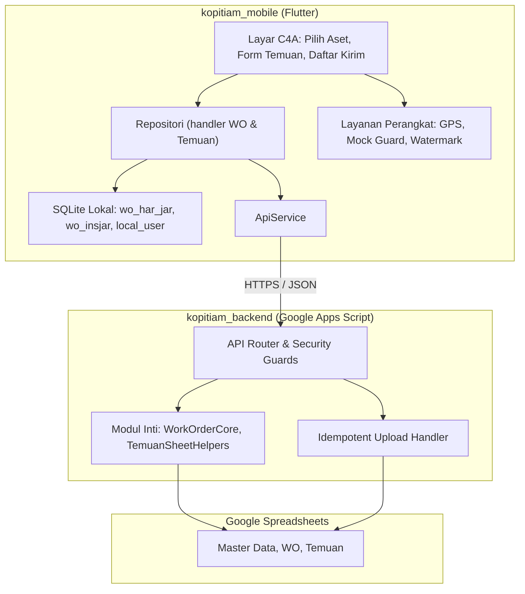
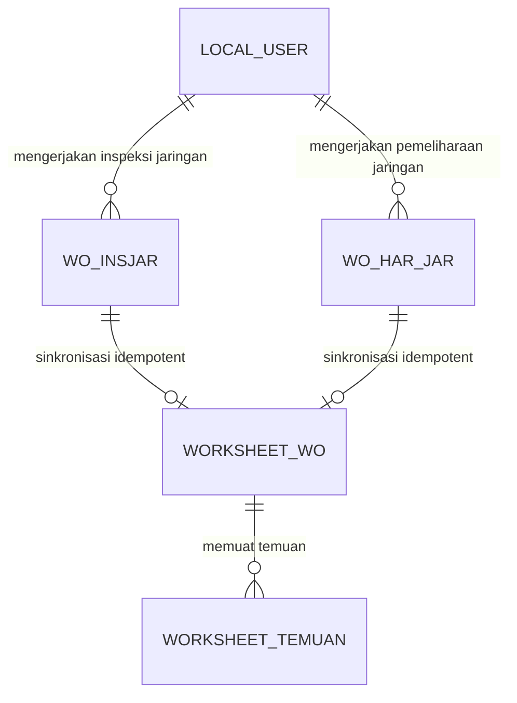

# PRD — Project Requirements Document

## 1. Overview

**Kopitiam-UID-Babel** adalah sistem operasional lapangan kelistrikan terpadu untuk wilayah kerja UID Babel. Sistem ini mengelola siklus kerja inspeksi dan pemeliharaan aset kelistrikan, mencakup gardu distribusi, jaringan distribusi, _Right of Way_ (ROW), serta pelayanan gangguan Yandal P0.

Tujuan utamanya adalah memastikan pekerjaan lapangan dapat tetap berjalan di area dengan koneksi tidak stabil, sekaligus menjaga keaslian dan integritas data yang dilaporkan. Setiap temuan anomali aset dicatat lengkap dengan koordinat GPS presisi dan foto bukti ber-_watermark_ otomatis, lalu disimpan terlebih dahulu di perangkat petugas sebelum dikirim ke pusat. Dengan begitu, sistem mendukung pelaporan yang akurat, dapat livacak, dan terhindar dari data ganda.

## 2. Requirements

Persyaratan utama yang menjadi acuan pengembangan sistem ini:

- **Operasional _offline-first_** — petugas dapat memilih aset, mencatat temuan, dan mengambil bukti lapangan tanpa harus bergantung pada koneksi internet.
- **Pembuktian data lapangan** — setiap pencatatan temuan memiliki bukti koordinat GPS berakurasi tinggi, proteksi terhadap pemalsuan lokasi (_mock location_), serta foto bukti yang diberi _watermark_ otomatis.
- **Integrasi alur kerja yang utuh** — sistem mendukung perjalanan data dari perangkat petugas ke pusat, masuk ke lembar temuan yang sama, dan tidak menghasilkan data ganda saat koneksi terputus lalu tersambung kembali.
- **Pengendalian akses berbasis peran** — modul tertentu seperti C4A hanya dapat diakses oleh peran yang berhak, baik dari sisi menu aplikasi maupun dari sisi validasi data pusat.
- **Keamanan konteks kerja** — setiap permintaan data dari perangkat diverifikasi otorisasinya oleh backend, sehingga petugas hanya bekerja pada unit/konteks yang menjadi tanggung jawabnya.
- **Mekanisme pengiriman yang andal** — temuan yang belum terkirim harus menunggu dalam antrean lokal dan dikirim otomatis ketika jaringan tersedia, dengan mekanisme idempoten agar tidak terjadi duplikasi di pusat.

## 3. Core Features

### Fase 1 — Pilih Aset & Catat Temuan C4A

**Pilih Aset C4A** — Layar form input temuan C4A (pilih aset + catat temuan dalam satu scroll) yang dibuka lewat tombol FAB '+' dari beranda daftar temuan lokal — bukan lagi halaman pembuka C4A.

- **Daftar Aset** — Menampilkan daftar aset yang tersedia untuk dinilai oleh petugas, bersumber dari data master aset di pusat.
- **Cari dan Filter** — Petugas dapat mencari aset berdasarkan nama, ID, atau unit aset agar aset yang dituju cepat ditemukan.
- **Pilih Aset** — Petugas menekan aset yang dipilih untuk melanjutkan ke proses pencatatan temuan.

**Catat Temuan C4A** — Mencatat temuan pada aset terpilih melalui form kategori, uraian, lokasi, dan foto bukti, dengan pengamanan kelengkapan data.

- **Aset yang Dinilai** — Aset terpilih selalu tampil di bagian atas form agar catatan yang dibuat tetap terhubung pada aset yang benar.
- **Isi Detail Temuan** — Petugas mengisi kategori temuan, uraian kondisi, dan lokasi temuan sesuai temuan di lapangan.
- **Lokasi dan Foto Bukti** — Sistem merekam koordinat GPS presisi dan mengambil foto lanskap ber-_watermark_ yang memuat konteks pekerjaan secara otomatis.
- **Periksa Kelengkapan** — Temuan hanya dapat disimpan/dikirim setelah informasi pokok dan foto bukti terisi lengkap.
- **Simpan Lokal** — Temuan yang sudah lengkap disimpan ke penyimpanan perangkat agar aman meskipun belum ada koneksi jaringan.

### Fase 2 — Kirim Temuan C4A

**Kirim Temuan C4A** — Mengirim temuan dari perangkat ke pusat dan memastikannya masuk ke lembar temuan yang sama, termasuk saat koneksi sempat terputus.

- **Daftar Temuan C4A (beranda & status)** — Beranda C4A: ketika menu C4A diklik, muncul daftar temuan yang masih lokal/draft beserta status, tombol Sinkron (kirim semua sekaligus), dan tombol FAB '+' kanan bawah untuk membuka form temuan baru.
- **Antrean Lokal** — Menampung temuan yang belum terkirim ketika perangkat sedang tanpa koneksi.
- **Kirim Otomatis** — Mengirim antrean begitu jaringan tersedia, melalui jalur sinkronisasi yang dirancang agar tidak menghasilkan data ganda.
- **Status dan Ulang Kirim** — Menampilkan status pengiriman masing-masing temuan dan menyediakan aksi kirim ulang untuk temuan yang gagal dikirim.

### Fase 3 — Akses Peran C4A

**Akses Peran C4A** — Membatasi modul C4A agar hanya Super User, Admin, dan Pegawai PLN yang dapat melihat serta membukanya; peran User/vendor tidak diberikan akses.

- **Menu Sesuai Role** — Menu C4A ditampilkan atau disembunyikan berdasarkan peran yang digunakan saat login.
- **Cegah Akses Tak Berhak** — Peran yang tidak berwenang tidak dapat masuk ke C4A meskipun mencoba membuka tautan langsung ke modul tersebut.
- **Peran Konsisten** — Sistem memastikan peran login di perangkat sesuai dengan data peran di pusat sehingga hak akses selalu benar dan tidak mudah dimanipulasi.

## 4. User Flow

Alur pengguna disusun mengikuti urutan fase C4A, dari pembukaan aplikasi, beranda daftar temuan lokal, pencatatan temuan baru (pilih aset + catat temuan), hingga pengiriman ke pusat.

1. Petugas membuka aplikasi dan sistem memeriksa sesi login pada `StartupScreen`.
2. Jika sesi tidak aktif, petugas masuk melalui `LoginScreen`/`LoginSheet`; sistem memvalidasi kredensial dan peran pengguna.
3. Setelah masuk, `DashboardRouter` menampilkan dashboard sesuai peran. Menu C4A hanya muncul untuk Super User, Admin, dan Pegawai PLN.
4. Petugas membuka C4A → sistem menampilkan **beranda daftar temuan lokal/draft** beserta status, tombol **Sinkron**, dan tombol **FAB '+'** di kanan bawah.
5. Untuk membuat temuan baru, petugas menekan **FAB '+'** → membuka layar form **Pilih Aset C4A** (pilih aset + catat temuan dalam satu scroll): mencari/memfilter dan memilih aset yang akan dinilai.
6. Petugas mengisi detail temuan pada `TemuanFormScreen`: kategori, uraian, dan lokasi.
7. Petugas mengambil foto bukti melalui kamera lanskap; _photo watermarking_ dan koordinat GPS presisi ditambahkan otomatis.
8. Sistem memeriksa kelengkapan form. Jika belum lengkap, petugas diminta melengkapi; jika lengkap, temuan **disimpan lokal** lalu kembali ke beranda dan **muncul di daftar temuan lokal**.
9. Petugas menekan tombol **Sinkron** untuk mengirim **seluruh** temuan lokal ke pusat sekaligus (antrean juga terkirim otomatis saat jaringan tersedia). Jika gagal, petugas dapat menekan kirim ulang.



## 5. Architecture

Sistem terdiri atas tiga lapisan utama yang sudah berjalan dan saling terhubung:

1. **Aplikasi Mobile (`kopitiam_mobile`)** — aplikasi Flutter yang digunakan petugas lapangan. Aplikasi ini _offline-first_: data temuan dan _Work Order_ disimpan lebih dulu ke SQLite lokal, didukung layanan perangkat seperti GPS presisi, proteksi lokasi palsu, dan watermark foto.
2. **Backend API (`kopitiam_backend`)** — API nirserver berbasis Google Apps Script yang menjadi gerbang komunikasi. Backend menangani router API, modul inti pemrosesan _Work Order_ dan temuan, pengamanan konteks kerja pengguna, serta penanganan unggahan idempoten agar tidak ada data duplikat.
3. **Penyimpanan Pusat (`Google Spreadsheets`)** — menyimpan master data, data _Work Order_, dan rekaman temuan lapangan. Backend menulis data ke spreadsheet melalui helper modul.

Mobile dan backend berkomunikasi melalui REST HTTPS/JSON. Backend melakukan validasi otorisasi untuk setiap permintaan, menjalankan logika bisnis, lalu menyimpan hasilnya ke spreadsheet. Di sisi mobile, antrean pengiriman memastikan data yang belum terkirim tidak hilang dan dikirim otomatis saat jaringan kembali tersedia.



## 6. Database Schema

Penyimpanan data terbagi menjadi dua sisi:

- **SQLite lokal** di perangkat petugas — menyimpan data transaksi agar pekerjaan tetap berjalan tanpa koneksi.
- **Google Spreadsheets** di pusat — menjadi data store terpusat untuk master data, _Work Order_, dan temuan.

Entitas yang terbukti terdokumentasi pada repositori:

| Lokasi              | Tabel / Koleksi | Kegunaan                                                                                                                       |
| ------------------- | --------------- | ------------------------------------------------------------------------------------------------------------------------------ |
| SQLite lokal        | `local_user`    | Menyimpan informasi sesi pengguna yang aktif di perangkat. Struktur kolom mengikuti berkas `user_app_mobile.sql`.              |
| SQLite lokal        | `wo_insjar`     | Menyimpan data _Work Order_ Inspeksi Jaringan beserta konteks pekerjaan lokal. Struktur kolom mengikuti `wo_insjar_table.sql`. |
| SQLite lokal        | `wo_har_jar`    | Menyimpan data _Work Order_ Pemeliharaan Jaringan beserta data tindak lanjut. Struktur kolom mengikuti `wo_har_jar_table.sql`. |
| Google Spreadsheets | Master Data     | Menyimpan data referensi aset dan data pendukung operasional.                                                                  |
| Google Spreadsheets | Data WO         | Menyimpan rekaman transaksi _Work Order_ dari berbagai jenis pekerjaan.                                                        |
| Google Spreadsheets | Data Temuan     | Menyimpan rekaman temuan lapangan hasil inspeksi/C4A.                                                                          |

> Catatan: dokumentasi tingkat tinggi tidak merinci seluruh nama kolom fisik tiap tabel. Definisi kolom yang pasti dikelola pada berkas skema di repositori, yaitu `wo_har_jar_table.sql`, `wo_insjar_table.sql`, dan `user_app_mobile.sql`, serta modul setup backend.



Diagram di atas menggambarkan hubungan konseptual: seorang petugas (`local_user`) bekerja pada _Work Order_ inspeksi/pemeliharaan jaringan yang tersimpan lokal; data tersebut kemudian disinkronkan ke spreadsheet pusat (`WORKSHEET_WO`); dari proses kerja tersebut lahir rekaman temuan yang tersimpan pada lembar temuan pusat (`WORKSHEET_TEMUAN`).

## 7. Tech Stack

Tech stack yang digunakan sudah ditetapkan dan berjalan di dalam codebase, bukan teknologi default.

**Aplikasi Mobile — `kopitiam_mobile`**

- Flutter (Dart) untuk aplikasi klien Android & iOS.
- SQLite sebagai basis data lokal perangkat.
- Android SDK dengan Gradle Kotlin DSL, serta iOS Runner (Xcode/Swift).
- Layanan perangkat: kamera lanskap, _photo watermarking_, GPS akurasi tinggi, dan proteksi _mock location_.
- REST HTTPS/JSON untuk komunikasi API melalui `ApiService`.

**Backend — `kopitiam_backend`**

- Google Apps Script (GAS) sebagai backend API nirserver.
- Modul router API: `Code.js`, `ZZ_ApiRouterOverride.js`.
- Modul inti: `WorkOrderCore.js`, `TemuanSheetHelpers.js`, `WorkOrderContext.js`, `SecurityValidation.js`.
- Penanganan unggahan idempoten: `IdempotentUpload.js`.
- Setup data awal dan konfigurasi sheet: `Setup.js`.

**Penyimpanan data**

- Google Spreadsheets sebagai data store terpusat.

**CI/CD & tooling**

- GitHub Actions untuk CI backend (`backend-ci.yml`), build/analisis Flutter (`flutter-ci.yml`), dan generasi ikon aplikasi (`app-icons.yml`).
- Node.js tooling dengan `@google/clasp` untuk deploy backend ke Google Apps Script.
- Python 3 untuk generator aset ikon aplikasi.

## 8. Detail Pencatatan Temuan C4A (Lembar `Inp_Temuan`)

C4A adalah inspeksi **tanpa Work Order** oleh peran Admin/Pegawai PLN. Karena tidak ada WO, identitas unit dan penomoran temuan **tidak bersumber dari WO**, melainkan diisi otomatis dari master yang login dan relasi master aset. Seluruh hasil inspeksi (ber-WO maupun C4A) disimpan pada lembar `Inp_Temuan` yang sama.

Struktur kolom `Inp_Temuan` (urutan mengikuti berkas asli):

`No | Kode UIW | Kode UP3 | Kode ULP | ULP | Kode WO | Kode Temuan | Hari | Tanggal | Penyulang | Section Awal | Section Akhir | Section | Segmen | Nomor Gardu | Koordinat Temuan | Lat Temuan | Long Temuan | Jenis Object | Tier | Temuan | Jarak Terhadap Jaringan | Jenis Pohon | Tinggi Pohon | Prioritas | Pekerjaan (Padam / Tanpa Padam) | Foto Temuan | Link Foto | Foto Lingkungan Sekitaran Tiang | Link Foto Sekitaran Tiang | Jenis WO | Waktu Input | User Input | Folder Path`

Pada jalur C4A, kolom `Kode WO` dan `Jenis WO` **dibiarkan kosong** (karena tanpa WO).

### 8.1 Pembagian isian: Pilih Aset vs Catat Temuan

**Termasuk proses Pilih Aset C4A** (penentu aset yang diinspeksi):

- `Jenis Object` — pilihan **Jaringan** atau **Gardu**; wajib karena menjadi penentu cabang aset yang dinilai.
- Kolom aset sesuai cabang (lihat §8.3 dan §8.4).
- Pilihan `Temuan` (filter menurut cabang).

**Termasuk proses Catat Temuan C4A:**

- `Tier` (dropdown: **Tier 1** / **Tier 2**).
- `Koordinat Temuan` / `Lat Temuan` / `Long Temuan` (khusus cabang Jaringan — ambil titik GPS saat kolom diklik).
- `Jarak Terhadap Jaringan`, `Tinggi Pohon`, `Jenis Pohon` (input manual; dipakai menghitung `Prioritas`).
- `Foto Temuan` + `Link Foto`, `Foto Lingkungan Sekitaran Tiang` + `Link Foto Sekitaran Tiang`.
- Kolom otomatis: `Waktu Input`, `User Input`, `Folder Path`, `Kode Temuan`.

### 8.2 Isian identitas unit & lingkup akses C4A

Akun yang login (peran Admin/Pegawai PLN maupun Super User) berada pada **salah satu level unit**: **UID**, **UP3**, atau **ULP**. Level akun ditentukan dari isi kolom `Kode UP3` dan `Kode ULP` pada baris akun di master `User_App_Mobile`:

| Level akun login                    | `Kode UP3` di akun | `Kode ULP` di akun | Dropdown unit yang muncul di C4A |
| ----------------------------------- | ------------------ | ------------------ | -------------------------------- |
| **UID** (mis. `16.BBL`, Super User) | kosong             | kosong             | `UP3` **dan** `ULP` (cascade)    |
| **UP3** (mis. `161.BGK`, `163.BLT`) | terisi             | kosong             | `ULP` saja                       |
| **ULP** (mis. `16100.TBL`)          | terisi             | terisi             | tidak ada (langsung unit akun)   |

Aturan penyaringan saat memilih unit:

- **UID / Super User login** → bebas memilih semua `UP3`, lalu setelah `UP3` dipilih, memilih `ULP` milik UP3 itu; baru setelah `ULP` terpilih, sistem menampilkan aset (penyulang/gardu) dari ULP tersebut.
- **UP3 login** → pilih `ULP` di antara ULP milik UP3 akun; lalu tampil aset ULP yang dipilih.
- **ULP login** → tanpa dropdown; aset langsung dari ULP akun.

Setelah unit `ULP` ditetapkan (dipilih atau dari akun), nilai **`Kode UIW`, `Kode UP3`, `Kode ULP`, `ULP`** yang disimpan ke lembar diambil dari baris unit yang berlaku; `User Input` ← `Username` login; `Waktu Input` ← waktu simpan.

**Super User** mengikuti perilaku level **UID** (bebas memilih semua UP3/ULP).

### 8.7 Label tampil unit pada dropdown C4A

Saat muncul sebagai dropdown, setiap kode unit **ditampilkan dengan label tersendiri** (kode mentah tetap menjadi nilai yang disimpan ke kolom `Kode UP3`/`Kode ULP`):

| Kode (nilai simpan) | Label tampil di dropdown |
| ------------------- | ------------------------ |
| `161`               | UP3 Bangka               |
| `163`               | UP3 Belitung             |
| `16100`             | ULP Pangkalpinang        |
| `16110`             | ULP Sungailiat           |
| `16120`             | ULP Mentok               |
| `16130`             | ULP Toboali              |
| `16140`             | ULP Koba                 |
| `16300`             | ULP Tanjung Pandan       |
| `16310`             | ULP Manggar              |

Nilai kolom pada lembar tetap berupa **kode angka** (`16100`), bukan label teks ("ULP Pangkalpinang"). Pemetaan kode → label ini juga menjadi dasar filtering master aset: begitu `ULP` berlaku, dropdown `Penyulang`/`Nomor Gardu` hanya menampilkan baris master yang `ULP`-nya sama.

### 8.3 Aturan `Kode Temuan` (generasi otomatis)

Format:

```
PEG-<Kode ULP><YYMMDD><NNN>.TO-<NNN>
```

| Bagian          | Makna         | Sumber / Aturan                                                                       |
| --------------- | ------------- | ------------------------------------------------------------------------------------- |
| `PEG`           | Prefix C4A    | Tetap                                                                                 |
| `<Kode ULP>`    | Kode unit ULP | ULP yang berlaku (dari akun atau hasil pemilihan §8.2)                                |
| `<YYMMDD>`      | Tanggal input | Format 2 digit tahun, bulan, tanggal                                                  |
| `<NNN>` pertama | Urutan temuan | Per kombinasi **(ULP + Penyulang + hari)**, **reset per hari**, 3 digit (`001`–`999`) |
| `.TO-<NNN>`     | Nomor urut TO | Per ULP; **1 temuan = 1 TO**, 3 digit                                                 |

Contoh: `PEG-16140250417001.TO-005` = ULP Koba `16140`, tanggal 17 April 2025 (`250417`), temuan ke-1 pada penyulang itu, TO ke-5.

Karena lingkup kecil per ULP, jumlah temuan per kombinasi tidak diperkirakan melebihi 100, sehingga 3 digit mencukupi.

### 8.4 Pemilihan aset menurut cabang `Jenis Object`

**Cabang Jaringan:**

- `Penyulang` → dropdown dari `Master_Penyulang`, **difilter `ULP` = ULP yang berlaku** (hasil §8.2/§8.7); nilai yang disimpan = `Nama Penyulang`.
- `Section Awal` → dropdown dari master Keypoint (lihat §8.6), difilter ULP + Penyulang.
- `Section Akhir` → dropdown yang sama, **mengecualikan nilai `Section Awal`** agar tidak duplikat.
- `Section` → gabungan teks `"<Section Awal> - <Section Akhir>"`.
- `Segmen` → input manual.
- `Koordinat` → **manual**, ambil titik GPS saat kolom diklik.

**Cabang Gardu:**

- `Nomor Gardu` → dropdown dari `Master_Gardu`, difilter ULP yang berlaku (§8.2/§8.7).
- Dari gardu terpilih, `Penyulang` dan `Section` **terambil otomatis** dari baris gardu tersebut.
- `Koordinat Temuan` / `Lat Temuan` / `Long Temuan` → **otomatis gabungan** nilai koordinat **X (latitude)** dan **Y (longitude)** dari gardu (`Master_Gardu`), digabung apa adanya dalam urutan `lat, long` (format `"-2.xx, 106.yy"` agar jatuh di wilayah Bangka Belitung). Nilai sumber sudah berupa desimal penuh.

**Pilihan `Temuan`** pada kedua cabang difilter bertingkat oleh **`Tier`** (dipilih di Catat Temuan) **dan** `Objek Inspeksi` (`Master_Temuan`) yang sama dengan cabang: jaringan → hanya `Objek Inspeksi` = Jaringan; gardu → hanya `Objek Inspeksi` = Gardu.

### 8.5 Aturan kolom `Prioritas`

Untuk temuan ROW — `Temuan` ∈ {`Rabas / Pangkas`, `Tebang Sedang`, `Tebang Besar`} — `Prioritas` ditentukan oleh **risiko batang menimpa konduktor saat tumbang**, dinilai lewat hukum Pythagoras:

```
a = Jarak Terhadap Jaringan (horizontal)
b = a            (titik awal pengukuran jarak terhadap jaringan dipakai sebagai tinggi acuan)
c = √(a² + a²) = a√2   (jangkauan roboh minimum agar menyentuh jaringan)
```

- Jika `Tinggi Pohon ≥ c` → batang berpotensi menimpa jaringan saat roboh → **Mayor**.
- Kombinasi lain yang memenuhi cabang awal (mis. `Jarak < 3` dan `Tinggi ≥ 9`) juga mengarah **Mayor**; sisanya mengikuti kategori Minor/Sedang/Mayor dari aturan awal.
- Untuk `Temuan` **di luar** tiga kriteria ROW tersebut → `Prioritas` diambil lewat `LOOKUP(Temuan → "db_Jenis_Temuan" → "Prioritas")`.

### 8.6 Relasi master data

| Master             | Struktur kolom (relevan)                                                                                                                                                         | Peran                                                                    |
| ------------------ | -------------------------------------------------------------------------------------------------------------------------------------------------------------------------------- | ------------------------------------------------------------------------ |
| `User_App_Mobile`  | Kode UIW, Kode UP3, Kode ULP, ULP, Username, Password, Role, Bidang, Tim, Sub-Tim                                                                                                | Sumber identitas unit & username login                                   |
| `Master_Penyulang` | ID, KODE ASET, UP3, ULP, GI/Sumber, Nama Penyulang, Tipe (Loop/Radial), Jumlah Gardu, Gardu Dicover, Gardu Belum, Beban (A), Tegangan Ujung (kV), SCADA (%), Latitude, Longitude | Dropdown `Penyulang` (filter ULP)                                        |
| `Master_Keypoint`  | ID, UP3, ULP, Penyulang, NAMA KEYPOINT, Jenis, Merek, Scada, Arus Pickup, Latitude, Longitude                                                                                    | Sumber dropdown `Section`/Keypoint (filter ULP + Penyulang)              |
| `Master_Gardu`     | NO, ULP, GARDU, ALAMAT, PENYULANG, PTS/LBS, LOKASI KELAS GARDU, LINE PRIMER GARDU, KOORDINAT LAT, KOORDINAT LONG, JENIS GARDU                                                    | Dropdown `Nomor Gardu` + sumber `Penyulang`/`Section`/koordinat          |
| `Master_Temuan`    | No, Tier, Objek Inspeksi, Temuan, Prioritas                                                                                                                                      | Dropdown `Temuan` (filter Tier + Objek Inspeksi), berlaku **lintas ULP** |
| `db_Jenis_Temuan`  | Temuan, Prioritas                                                                                                                                                                | Fallback `LOOKUP` untuk temuan non-ROW                                   |

## 9. REL-07: Jurnal Operasi Durable dan Rekonsiliasi

Seluruh operasi tulis sinkronisasi WO dan Temuan melewati jurnal durable sebelum efek bisnis dijalankan. Perubahan ini tidak mengubah layar, urutan kerja petugas, field bisnis, kebijakan foto, atau aturan penghapusan data lokal.

- Operation ID mengikat pengguna live, action, identitas objek kanonik, payload digest, dan digest byte foto bila relevan. Digest foto kiriman wajib cocok dengan byte foto aktual.
- Snapshot durable tidak menyimpan token, device token, atau password. Payload dan receipt disimpan dengan checksum terpisah.
- Status jurnal mencakup `prepared`, `processing`, `needs-reconciliation`, `committed`, `archived`, dan `purged`. Hanya receipt committed yang terverifikasi boleh dianggap sukses atau direplay.
- Lease mencegah executor ganda. Pemulihan lease macet dan retensi membaca ulang record berdasarkan Operation ID di bawah lock sebelum mutasi.
- Rekonsiliasi bisnis tetap memerlukan sesi pengguna live dan tidak dapat dijalankan trigger tanpa otorisasi pengguna.
- Temuan hanya committed setelah hasil Sheet dan Drive dibaca ulang, seluruh field kiriman terpetakan, folder serta foto cocok, dan receipt final lolos verifikasi.
- Mobile hanya boleh menghapus data lokal setelah menerima receipt committed yang cocok. Status prepared atau needs-reconciliation bukan sukses.
- Retensi aktif adalah 30 hari untuk committed/resolved dan 90 hari untuk gagal. Arsip disimpan satu tahun; record unresolved tidak dihapus otomatis.

Deployment produksi, pemasangan trigger, konfigurasi Script Properties, dan fault injection staging adalah tahap verifikasi terpisah setelah source digabung.
